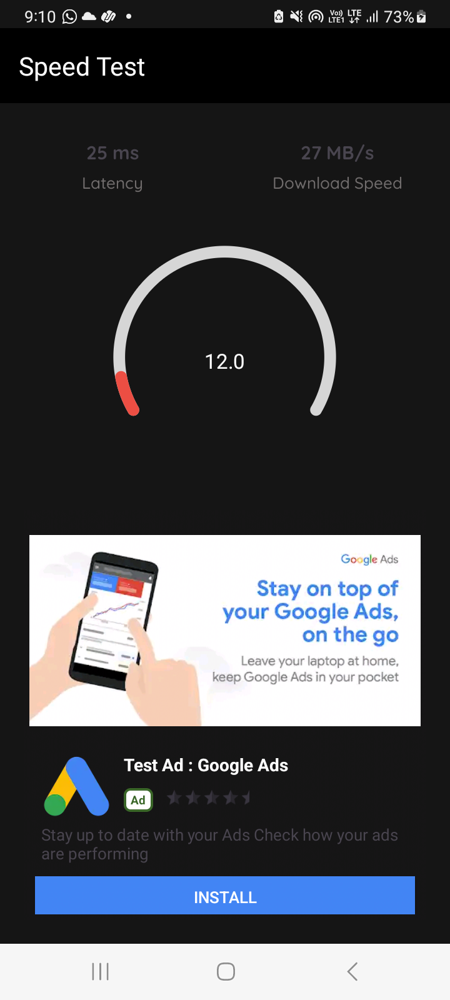

# Internet Speed Tester

Internet Speed Tester is an Android application that allows users to measure the speed of their internet connection in real-time. The app features a visually appealing gauge interface that displays download speed, latency, and includes support for AdMob native ads.
## 📸 Visuals

Here's a sneak peek:  

## Features

- **Real-time Internet Speed Test**: The app measures and displays the download speed of your internet connection in MB/s.
- **Interactive Gauge Interface**: The speed test results are shown on a dynamic gauge that changes color based on speed.
- **Latency Measurement**: The app also calculates and displays the latency (ping) of your connection.
- **AdMob Native Ads Integration**: Monetize the app with native ads that blend seamlessly with the app's UI.

## Installation

To run this project on your local machine:

1. Clone the repository:
   ```bash
   git clone https://github.com/samyak2403/internet-speed-tester.git


# Internet Speed Test App

This Android application measures internet speed and displays the results in a visually engaging way, along with displaying native ads for monetization.

## Getting Started

### Prerequisites
- Ensure you have the latest version of Android Studio installed.
- Install all required dependencies as prompted by Android Studio.

### Setup

1. Clone the repository:
    ```bash
    git clone https://github.com/your-username/your-repository.git
    ```
2. Open the project in Android Studio.
3. Replace the placeholder `YOUR_ADMOB_NATIVE_AD_UNIT_ID` in the `AdUtils.kt` file with your actual AdMob Native Ad Unit ID.

### Running the App

1. Build and run the project on an Android device or emulator.

## How It Works

- The app uses the `SpeedTestSocket` library to perform internet speed tests by downloading a file and measuring the transfer rate.
- The results are displayed on a graphical gauge that is color-coded to indicate different speed ranges.
- A native ad is displayed below the speed test results to generate revenue.

## Key Components

- **MainActivity**: The core activity that handles the speed test process and UI updates.
- **Gauge Interface**: Displays the download speed in a visually engaging way.
- **AdUtils**: A utility class that stores AdMob unit IDs and manages ad loading.

## Screenshots

| Real-time Speed Test | Native Ad Integration |
|----------------------|-----------------------|
|  |  |

## License

This project is licensed under the MIT License. See the [LICENSE](LICENSE) file for more details.

## Contributing

Contributions are welcome! If you'd like to contribute to this project, please fork the repository and submit a pull request. For major changes, please open an issue first to discuss what you would like to change.

## Tags

Android, Internet Speed, Speed Test, AdMob, Native Ads, Kotlin, Java, Open Source

## Contact

For any questions or issues, feel free to open an issue on GitHub or contact me directly at [arrowwould@gmail.com](arrowwould@gmail.com).
